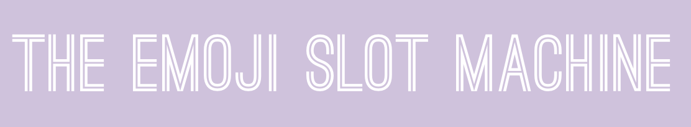
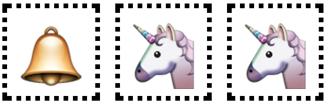
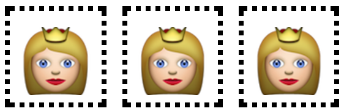
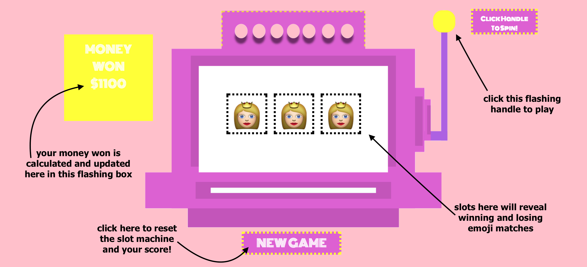
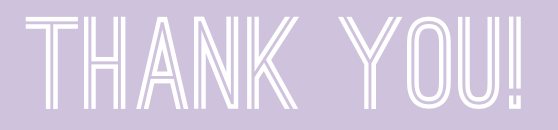

<h4 align="center">
  
</h4>

<b>Hello there fellow gamblers!</b> Welcome to the one and only **Emoji Slot Machine**! Whether you are a novice slot machine player or basically live in a casino, the **Emoji Slot Machine** makes it easy and fun to spend (fake) money! Equipped with fun flashing animations and pretty high winning odds, **Emoji Slot Machine** is as enjoyable to watch as it is to play... almost feels as if you were in the Sin City itself! 

<br>
For those unfamiliar with Slot Machines and their history, check out the provided links below to learn more.

- [History of the Slot Machine](https://en.wikipedia.org/wiki/Slot_machine)
via Wikipedia.

- [How it's Made](https://www.youtube.com/watch?v=oOaheJhGNj8)
via Youtube.

---
---
<h4> Now Let's Get Started... </h4>

---
<h3 align="center"> 
    
</h3>

 <h4>This next bit walks us through the simple instructions for playing the **Emoji Slot Machine** properly. It really is quite simple. Refer to the attached images for a more visual look at how to play.
--
<center> <u>Before You Begin:</u></center>
    There are <u><b>8</b></u> possible Emoji's that can be matched up. Let's take a look at a couple of combinations:</br>
     <h5 align="center">
      
     </h5> 

- combination 1:
    - TWO IN A ROW! Pictured Above is two of    a kind. When two of the same Emoji's      appear, (next to each other or not)       $100 dollars gets added to your total     money earned.
     
<h5 align="center">
      
     </h5> 

- combination 2.
    - NO MATCH! uh oh. Pictured above, when none of the slots contain a matching Emoji, $75 is deducted from your total money earned. 

<h5 align="center">
      
     </h5> 

- combination 3:
    - THREE OF A KIND! Woohoo! You score big when each slot contains the same Emoji like the picture above. $500 is added to your total money earned.

<h4><u>Step by Step Instructions:</u></h4>

1. Go to Emoji Slot Machine URL
    - [CLICK ME](https://bchelsea.github.io/Slot-Machine/)
    - Your total Money Won will begin at $500

2. Click flashing handle on the right hand       side to start Emoji Slot Machine
    -  When combination appears:
       - If a Three of A Kind combination you will be notified on the slot machine screen and your total money won will be updated.
       - If a Two of A Kind combination you will not be notified on the slot machine screen and your total money won will be updated.
       - If a No Match combination you will not be notified on the slot machine screen and your total money won will be updated.
    - Repeat process until you become a         billionaire or you run out of Money Won.

3. If your Total Money Won hits 0 or below:
    - It is **<u>GAME OVER</u>**. You will be   notified on the slot machine screen       that your are out of cash and you will    be prompted to click <b>NEW GAME</b>
        - when **NEW GAME** button is clicked,  your total Money Won is reset to      the starting $500 and you are then    able to start playing **Emoji Slot    Machine** again.
4. Click NEW GAME
    - NEW GAME button allows your total Money Won.. or lost (he he) to be reset too the starting $500 amount. 

</h3>Check out this image of **Emoji Slot Machine** made with some edits to better show you which things do what while you are playing.</h3>

<h5 align="center">
      </h5>

---
---

<h4> Let's Continue... </h4>

---

<h5 align="center">
      
     </h5>


 <h4>I used simple technlogies to build the Emoji Slot Machine. Below I have created a list showcasing how Emoji SLot Machine came to be.</h4>

1) Hover Animations in CSS:

   ```
   button:hover {
        background-color: yellow;
        border: 5px dotted #dd60d2;
        color: black;

2) Interval Functions in JS to have flashing boxes: 

    ```
    setInterval(function () {
    $('.spin').css('background-color', function () {
        this.switch = !this.switch
        return this.switch ? 'yellow' : 
    });}, 500) ```
    
3) Mac OS; Pages:
    - I used Pages in order to create the background image of the main slot machine. I then saved the document and exported it as a PNG. 

---
---

<h4> Lastly... </h4>

---

<h5 align="center">
      </h5>

There is always something to look forward to in Version 2! Though I learned a lot throughout the building of **Emoji Slot Machine**, there are many features im excited to explore and add in the near future:

- Adding sounds to buttons when they are clicked.
- Discovering ways to better animate the shuffling and randomizing of the row of slots in **Emoji Slot Machine**
- shuffling through background images:
    - so each time the user reloads the page a differet background appears making it more exciting to play.
---
---

<h5 align="center">
      
     </h5>

  Thank you for reading and  playing the Emoji Slot Machine. I hope you enjoyed it! Stay tuned for more exciting changes and features! 


